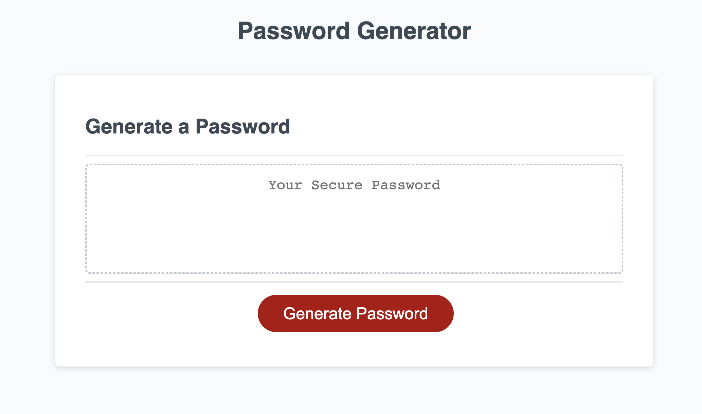
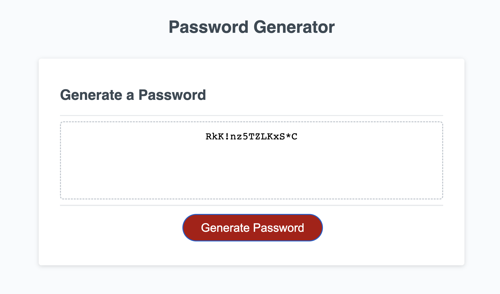

# Random Password Generator

## Description

Have you ever needed a super-secure password but didn't want to just smash the keyboard in a text program to get one? This password generator can help! This password generator provides a simple and easy way to write a secure password with your choice of password length and character types. The user is able to input the desired length of their password as well as select any combination of uppercase letters, lowercase letters, numbers and symbols.

This project gave me a more in-depth insight into JavaScript functions and their capabilities. I am now able to utilize if-else statements and for loops within a function to return a more specific and curated result. The array and string methods I became familiar with during this project were used to generate a chosen character bank to choose the random characters from and then convert the array to a string to be returned as the generated password.

## Installation

To run the code, clone the project directories from [my repository](https://github.com/sillytsundere/password-maker) and open the index.html, style.css and script.js files in preferred code editor. The HTML and CSS files can be viewed to examine the basic display elements and the styling that is applied to the webpage. The Javascript file can be viewed to inspect the interactivity of the webpage. 

## Usage

The webpage is straightforward and easy to use; it contains a header, text box for displaying the generated password and the "Generate Password" button to initiate password creation. The following screenshot is how the page appears in the browser before initiating password generation by clicking the button element.

As seen in the JavaScript file there is an event listener on the HTML button element which, when clicked on, will run the functions and generate a random password. The screenshot below shows the generated password appearing in the text area HTML element(text box) above the HTML button element(the "Generate Password" button).

## Credits

Source code was obtained from [The Coding Bootcamp](https://github.com/coding-boot-camp/friendly-parakeet)

The following articles were referenced to write the JavaScript code:

[MDN article on Arrays](https://developer.mozilla.org/en-US/docs/Web/JavaScript/Reference/Global_Objects/Array)

[MDN article on Strings](https://developer.mozilla.org/en-US/docs/Web/JavaScript/Reference/Global_Objects/String)

[MDN article on Functions](https://developer.mozilla.org/en-US/docs/Web/JavaScript/Guide/Functions)

[MDN article on Loops and Iteration](https://developer.mozilla.org/en-US/docs/Web/JavaScript/Guide/Loops_and_iteration)

## Support

Reach out to me if you have any questions at:

[My Github page](https://github.com/sillytsundere)

## License

MIT License
